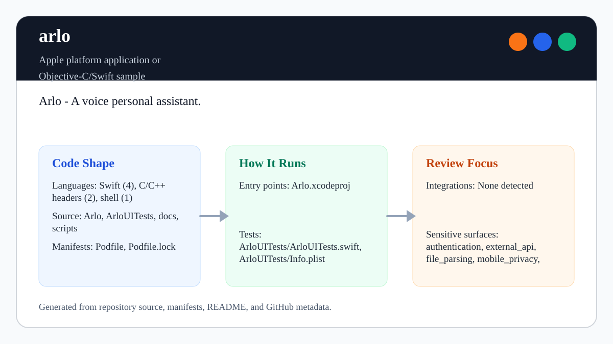

# Arlo

<!-- README-OVERVIEW-IMAGE -->


Legacy Swift iOS voice assistant prototype using speech synthesis, Wit.ai voice
capture, and a Siri-style waveform UI.

## Toolchain

- Open the CocoaPods workspace: `Arlo.xcworkspace`
- CocoaPods lockfile: `Podfile.lock`
- Main app target: `Arlo`
- UI test target: `ArloUITests`
- Voice dependencies: `Wit 4.1.0` and `SCSiriWaveformView 1.0.3`

Xcode is not available in this environment, so this pass verifies source
privacy and configuration drift without building the simulator app.

## Verify

Run the SDK-free baseline check:

```sh
scripts/check-baseline.sh
```

When Xcode is available, inspect and build through the workspace:

```sh
xcodebuild -list -workspace Arlo.xcworkspace
xcodebuild -workspace Arlo.xcworkspace -scheme Arlo -sdk iphonesimulator build
```

## Credential Policy

Committed Wit.ai access-token placeholders must stay empty. Real service tokens,
recorded audio, transcripts, signing files, and local build settings belong
outside Git.

## Modernization Notes

The current baseline avoids launch crashes from forced audio-session setup,
keeps Wit token assignment guarded, removes direct logging of voice callback
data, and invalidates the waveform display link during teardown. Future work
should move local credentials into an ignored configuration file, modernize
Swift/CocoaPods dependencies, and add simulator or device verification for
microphone permissions, speech synthesis, and waveform updates.
